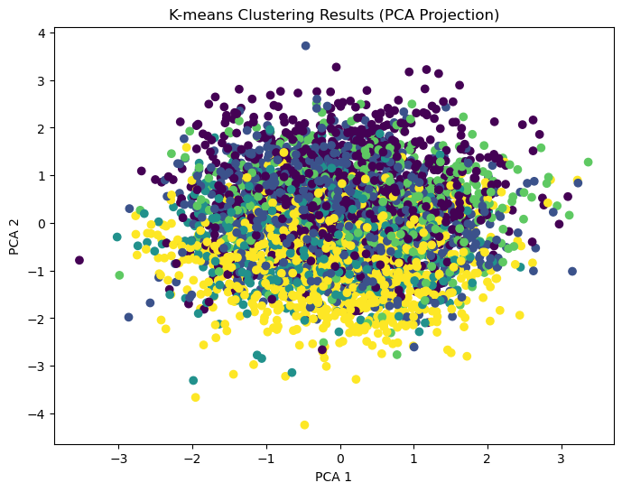

# 📊 BI Final Project – Tel-Hai College

## 📄 Overview
This repository contains the **final project** for the *Business Intelligence* course at Tel-Hai College (Spring Semester 2025).  
The project demonstrates **Classification**, **Clustering**, and **Association Rule Mining** techniques on three different datasets, applying data preprocessing, model building, and result interpretation using Python.

---

## 🚀 Project Highlights

| Part | Goal | Main Methods | Key Output |
|------|------|--------------|------------|
| **Classification** | Predict 10-year CHD risk | Random Forest, Decision Tree | Accuracy, Precision, Recall |
| **Clustering** | Group patients by symptoms | Elbow Method, K-Means | Optimal cluster selection, PCA visualization of clusters |
| **Association Rules** | Find product purchase patterns | Apriori Algorithm | Frequent itemsets and business insights |

---

## 📊 Part 1 – Classification: Heart Disease Risk Prediction
**Dataset:** `framingham.csv`

- **Goal** – Predict whether a patient will develop CHD within 10 years.
- **Approach** – Implemented Random Forest to determine important variables and Decision Tree for prediction.
- **Evaluation Metrics** – Accuracy, Precision, and Recall calculated using a 70/30 train-test split.
- **Overfitting Prevention** – Discussed pruning and hyperparameter tuning.


---

## 🧩 Part 2 – Clustering: Patient Triage
**Dataset:** `patient_dataset.csv`

- **Goal** – Group patients based on symptom severity to prioritize treatment.
- **Elbow Method** – Used to determine the optimal number of clusters.
- **K-Means Clustering** – Applied to group patients, results visualized in 2D using PCA.

**📷 Visualization 1:** *Elbow Method Graph*  
  
*Shows the Within-Cluster Sum of Squares (WCSS) vs. number of clusters. The elbow point indicates the optimal cluster count.*

**📷 Visualization 2:** *K-Means Clustering (PCA Projection)*  
  
*Scatter plot of patients in PCA-reduced 2D space, colored by their assigned K-Means cluster.*

---

## 🛒 Part 3 – Association Rules: Market Basket Analysis
**Dataset:** `GroceryDataset.csv`

- **Apriori Algorithm** – Extracted frequent itemsets from grocery transaction data.
- **Support ≥ 50% & Confidence ≥ 70%** – Ensured strong and relevant rules.
- **Example Insight** – Customers buying *Bread* and *Milk* often also purchase *Butter*.

**Business Application:** Helps retailers optimize store layouts, promotions, and product recommendations.

---

## 📂 Repository Structure
```
BI-Final-Assignment-TelHai/
│
├── classification_analysis.ipynb   # Main analysis notebook
├── framingham.csv                   # Classification dataset
├── patient_dataset.csv               # Clustering dataset
├── GroceryDataset.csv                # Association dataset
└── Final_HW-Tel-Hai.pdf              # Original assignment questions from lecturer
```

---

## 🛠 Requirements
- Python 3.9+
- pandas
- numpy
- matplotlib
- seaborn
- scikit-learn
- mlxtend

Install dependencies:
```bash
pip install pandas numpy matplotlib seaborn scikit-learn mlxtend
```

---

## ▶️ How to Run
1. Clone this repository:
```bash
git clone https://github.com/your-username/BI-Final-Assignment-TelHai.git
cd BI-Final-Assignment-TelHai
```
2. Install the required packages:
```bash
pip install -r requirements.txt
```
3. Open and run the Jupyter Notebook:
```bash
jupyter notebook classification_analysis.ipynb
```

---

## 📌 Author
**Daniel Bonder**  
Tel-Hai College – Business Intelligence Final Project (2025)
