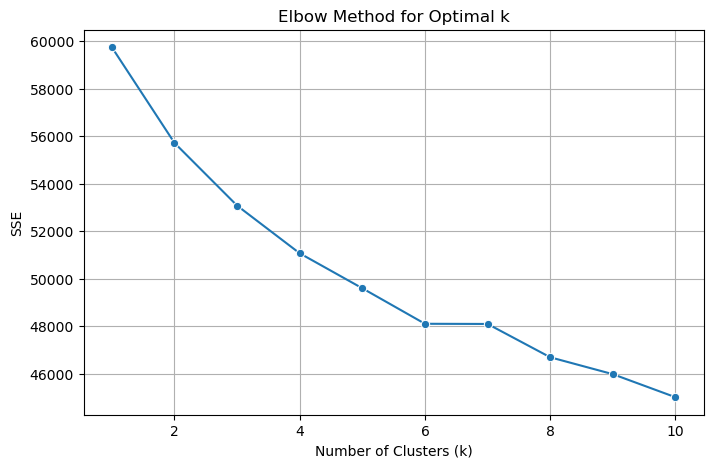

# 📊 BI Final Project – Tel-Hai College

## 📄 Overview
This repository contains the **final project** for the *Business Intelligence* course at Tel-Hai College (Spring Semester 2025).  
The project demonstrates **Classification**, **Clustering**, and **Association Rule Mining** techniques on three different datasets, applying data preprocessing, model building, and result interpretation using Python.

---

## 🚀 Project Highlights

| Part | Goal | Main Methods | Key Output |
|------|------|--------------|------------|
| **Classification** | Predict 10-year CHD risk | Random Forest, Decision Tree | Feature importance, Accuracy, Precision, Recall |
| **Clustering** | Group patients by symptoms | Elbow Method, K-Means | Optimal cluster selection, Patient group visualization |
| **Association Rules** | Find product purchase patterns | Apriori Algorithm | Frequent itemsets and business insights |

---

## 📊 Part 1 – Classification: Heart Disease Risk Prediction
**Dataset:** `framingham.csv`

- **Feature Importance with Random Forest** – Identified the most influential factors affecting CHD risk over the next 10 years.
- **Decision Tree Classifier** – Trained with 70% training / 30% testing split.
- **Performance Metrics** – Calculated Accuracy, Precision, and Recall to evaluate model quality.
- **Overfitting Prevention** – Discussed pruning and parameter tuning.

**📷 Visualization:** *Feature Importance*  
  
*This graph ranks the dataset features by their importance score from the Random Forest model, helping to focus on the most impactful health indicators.*

---

## 🧩 Part 2 – Clustering: Patient Triage
**Dataset:** `patient_dataset.csv`

- **Goal** – Group patients based on symptom severity to prioritize treatment areas.
- **Elbow Method** – Used to determine the optimal number of clusters.
- **K-Means Clustering** – Segmented patients into predefined clusters.

**📷 Visualization:** *Elbow Method Graph*  
  
*This plot shows the Within-Cluster Sum of Squares (WCSS) vs. the number of clusters. The "elbow point" indicates the optimal cluster count for efficient grouping.*

---

## 🛒 Part 3 – Association Rules: Market Basket Analysis
**Dataset:** `GroceryDataset.csv`

- **Apriori Algorithm** – Extracted frequent itemsets from customer purchase data.
- **Support ≥ 50% & Confidence ≥ 70%** – Ensured that only strong and relevant rules were kept.
- **Example Insight** – Customers who buy *Bread* and *Milk* are highly likely to also buy *Butter*.

**Business Impact:** Retailers can use these rules to optimize product placement, promotions, and cross-selling strategies.

---

## 📂 Repository Structure
```
BI-Final-Assignment-TelHai/
│
├── classification_analysis.ipynb   # Main analysis notebook
├── framingham.csv                   # Classification dataset
├── patient_dataset.csv               # Clustering dataset
├── GroceryDataset.csv                # Association dataset
└── Final_HW-Tel-Hai.pdf              # Original assignment questions from lecturer
```

---

## 🛠 Requirements
- Python 3.9+
- pandas
- numpy
- matplotlib
- seaborn
- scikit-learn
- mlxtend

Install dependencies:
```bash
pip install pandas numpy matplotlib seaborn scikit-learn mlxtend
```

---

## ▶️ How to Run
1. Clone this repository:
```bash
git clone https://github.com/your-username/BI-Final-Assignment-TelHai.git
cd BI-Final-Assignment-TelHai
```
2. Install the required packages:
```bash
pip install -r requirements.txt
```
3. Open and run the Jupyter Notebook:
```bash
jupyter notebook classification_analysis.ipynb
```

---

## 📌 Author
**Daniel Bonder**  
Tel-Hai College – Business Intelligence Final Project (2025)
